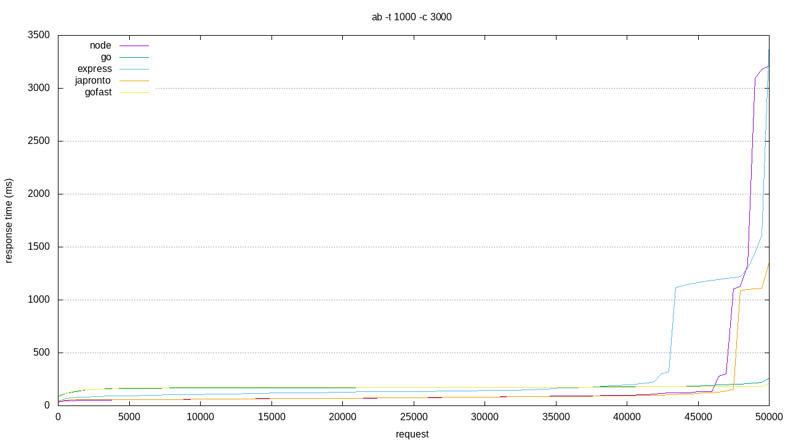

# Dumb Server
Dumb Server is a project aimed at benchmarking various http servers.
# Getting Started
## Prerequisites
### Tools
1. [ab](https://httpd.apache.org/docs/2.4/programs/ab.html) Apache HTTP server benchmarking tool
2. [gnuplot](http://www.gnuplot.info/) portable command-line driven graphing utility
### Language/Framework
1. [golang](https://golang.org/) 
2. [nodejs](https://nodejs.org/en/)
3. [python](https://www.python.org/)
# Installing
## Tools
```bash
    sudo apt-get install apache2-utils
    sudo apt-get install gnuplot
```
# Running the tests
## Generate .tsv files for each server

1. Start server
```bash
    bash server.sh <server_name>
            server_name : go | gofast | node | express | python
```
2. make request to started server
```bash
    bash request.sh <server_name>
            server_name : go | gofast | node | express | python
```
## Produce graph with .tsv files
```bash
    gnuplot plot.p
```

# Results
## Machine Specs
OS : Ubuntu 18.04.5 LTS<br>
Memory : 12Gb<br>
Processor : Intel® Core™ i7-7500U CPU @ 2.70GHz × 4<br>

## Request Details
Request Time : 1000s<br>
Number of Concurrent Request : 3000<br>

## Request Per Second vs Type of Server


## Benchmark


# Contributing
## Step 1

- **Option 1**
    - 🍴 Fork this repo!

- **Option 2**
    - 👯 Clone this repo to your local machine 

## Step 2

- **HACK AWAY!** 🔨🔨🔨

## Step 3

- 🔃 Create a new pull request
